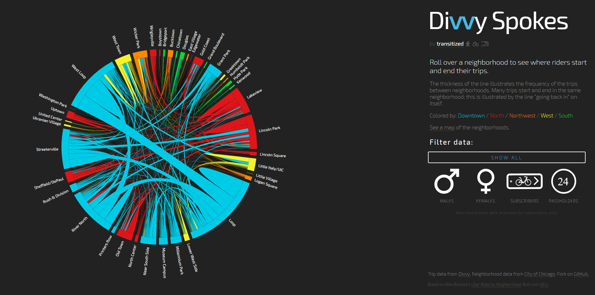
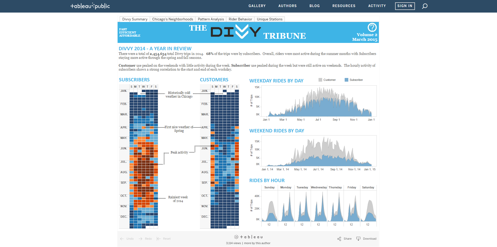

Thanks to Divvy's open data policy, a lot of people have used Divvy data to create wonderful products that provide insights into the bike share service. In particular, Divvy held the Divvy Data Challenge both in 2014 and 2015 to encourage many talented people to work with its data. The following presents three of my favorite products using Divvy data.
  
***
  
###[Divvy Stoke](http://transitized.com/divvyspokes/) by Shuan Jaconsen
  
This beautiful interactive chord diagram illustrates where Divvy riders start and end their trips. Its viewer can filter the trips by the user type (subscribers vs. 24-hour pass holders) and gender. Also, the viewer can hover over the name of each neighborhood on the diagram to see where the trips originating from that neighborhood head to.
  

  
***
  
###[The Divvy Tribune](https://public.tableau.com/profile/chicagodataviz#!/vizhome/DivvyDataChallenge_0/DivvySummary) by Sean Reynolds and Daniel Nguyen
  
This work offers a highly comprehensive overview of all Divvy rides in 2014. It covers every nook and cranny of Divvy data, analyzing the trips by time, neighborhoods, rider types (gender and age), unique stations and more. All graphs are not only aesthetically pleasing but also interactive, providing viewers with an enjoyable and engaging experience of exploring the data.
  

  
***
  
###[A moving map of Divvy trips](http://www.mike-joyce.biz/divvy/) by Mike Joyce and Patrick Carolan
  
Sometimes, less is more. The work offers a simple, yet stunningly beautiful illustration of all Divvy trips made in 2014. A viewer is free to move the map around and zoom in or out in order to better follow the travelling dots. 
  
